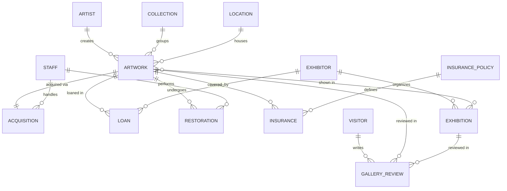

# Art Gallery — Spring Boot Backend

REST API for an Art Gallery management system, migrated from an
ASP.NET Core + Oracle solution to **Java 17 + Spring Boot 3** with
Spring Data JPA/Hibernate, Spring Security and PostgreSQL.

This project implements **PART I** of the assignment (OLTP CRUD application).

## Tech stack

| Concern         | Technology                                   |
|-----------------|----------------------------------------------|
| Language        | Java 17                                       |
| Framework       | Spring Boot 3.3                                |
| Persistence     | Spring Data JPA / Hibernate                    |
| Database (dev)  | PostgreSQL 16                                  |
| Database (test) | H2 (in-memory)                                 |
| Security        | Spring Security (JDBC users, form login, BCrypt) |
| Validation      | Jakarta Bean Validation                        |
| Logging         | SLF4J / Logback                                |
| Testing         | JUnit 5, Mockito, AssertJ, MockMvc, JaCoCo     |
| Build           | Maven                                          |

## Domain model

`Artwork` is the central entity. Artists create artworks; collections and
locations group them; acquisitions, loans, restorations and insurances track
their lifecycle; exhibitions show them (many-to-many); visitors review them.



### Relationship summary

- `Artist 1—* Artwork` (`@ManyToOne` on `Artwork.artist`)
- `Collection 1—* Artwork`, `Location 1—* Artwork` (optional)
- `Artwork 1—1 Acquisition` (`@OneToOne`)
- `Staff 1—* Acquisition`, `Staff 1—* Restoration`
- `Artwork 1—* Loan`, `Exhibitor 1—* Loan`
- `Artwork 1—* Restoration`, `Artwork 1—* Insurance`
- `InsurancePolicy 1—* Insurance`
- `Exhibitor 1—* Exhibition`
- `Artwork *—* Exhibition` (pure `@ManyToMany`, join table `artwork_exhibition`,
  `Artwork` is the owning side)
- `Visitor 1—* GalleryReview`; a review references an artwork and/or exhibition

## Architecture

Layered, package-by-layer under `com.artgallery`:

```
model        JPA entities (Lombok, IDENTITY ids)
repository   Spring Data JPA repositories
dto          Request/Response records with Bean Validation
mapper       DtoMapper (entity ↔ DTO)
service      @Transactional business logic + rules
controller   REST controllers (/api/**) with ApiResponse envelope
exception    Domain exceptions + GlobalExceptionHandler
config       SecurityConfig, data seeders, request logging filter
```

### Response envelope

All responses use a consistent envelope:

```json
{
  "success": true,
  "status": 200,
  "message": "...",
  "data": { },
  "errors": null,
  "timestamp": "..."
}
```

List endpoints return a `PageResponse` in `data`:
`{ content, page, size, totalElements, totalPages, first, last, numberOfElements }`.

Validation failures (HTTP 400) put a `{ field: message }` map in `data` and a
flat list in `errors`.

## Endpoints

Base path: `/api`. Collection endpoints accept `page`, `size` and `sort`
(e.g. `?page=0&size=10&sort=name,asc`).

| Resource           | Path                       | Search | Notes |
|--------------------|----------------------------|:------:|-------|
| Artworks           | `/artworks`                | ✓      | FK: artist, collection, location |
| Artists            | `/artists`                 | ✓      | |
| Collections        | `/collections`             |        | |
| Locations          | `/locations`               |        | |
| Exhibitions        | `/exhibitions`             | ✓      | `/{id}/artworks` (M2M) |
| Exhibitors         | `/exhibitors`              | ✓      | |
| Visitors           | `/visitors`                | ✓      | |
| Staff              | `/staff`                   | ✓      | |
| Loans              | `/loans`                   |        | `/by-artwork/{id}` |
| Insurances         | `/insurances`              |        | `/by-artwork/{id}` |
| Insurance policies | `/insurance-policies`      |        | |
| Restorations       | `/restorations`            |        | `/by-artwork/{id}` |
| Reviews            | `/reviews`                 |        | `/by-artwork/{id}`, `/by-exhibition/{id}` |
| Acquisitions       | `/acquisitions`            |        | |

Many-to-many management on exhibitions:

- `GET    /api/exhibitions/{id}/artworks`
- `POST   /api/exhibitions/{id}/artworks/{artworkId}`
- `DELETE /api/exhibitions/{id}/artworks/{artworkId}`

### Authentication

| Method | Path                | Body                          |
|--------|---------------------|-------------------------------|
| POST   | `/api/auth/login`   | form: `username`, `password`  |
| POST   | `/api/auth/logout`  | —                             |
| GET    | `/api/auth/me`      | —                             |

Reads are open to authenticated users; writes require `ROLE_ADMIN`
(`@PreAuthorize`). Creating a review is allowed for `ROLE_USER` too.

## Security

- `JdbcUserDetailsManager` over `users` / `authorities` tables (`schema.sql`)
- BCrypt password encoding
- Form login returning JSON, JSON 401/403 entry points
- Remember-me cookie, session-cookie auth
- CORS allowing `http://localhost:5173` with credentials
- Method-level security (`@EnableMethodSecurity`)

Seeded users (`DataInitializer`, all profiles):

| Username | Password   | Roles                     |
|----------|------------|---------------------------|
| `admin`  | `admin123` | `ROLE_ADMIN`, `ROLE_USER` |
| `user`   | `user123`  | `ROLE_USER`               |

## Profiles & configuration

| Profile | Database     | Notes |
|---------|--------------|-------|
| `dev`   | PostgreSQL   | Demo data via `DevDataSeeder` |
| `test`  | H2 in-memory | Used by integration tests |

PostgreSQL connection is overridable via env vars:
`POSTGRES_URL`, `POSTGRES_USER`, `POSTGRES_PASSWORD`.

## Running

### 1. Start PostgreSQL (Docker)

```bash
docker compose up -d
```

This starts `postgres:16-alpine` on port 5432 with database/user/password
`artgallery`.

### 2. Run the API

```bash
mvn spring-boot:run -Dspring-boot.run.profiles=dev
```

On Windows PowerShell, quote the argument:

```powershell
mvn spring-boot:run "-Dspring-boot.run.profiles=dev"
```

API available at `http://localhost:8080`.

### 3. Run the frontend

See `../art-gallery-spring-frontend/README.md` (Vue 3 SPA on port 5173).

## Testing

```bash
mvn test                # run unit + integration tests
mvn verify              # also produces JaCoCo coverage report
```

- **123 tests** (14 service unit-test classes + 3 integration-test classes).
- Service-layer instruction coverage **≈92%** (requirement ≥70%).
- Integration tests use `@SpringBootTest` + `MockMvc` + `spring-security-test`
  against the H2 `test` profile.

The JaCoCo HTML report is generated at `target/site/jacoco/index.html`.
